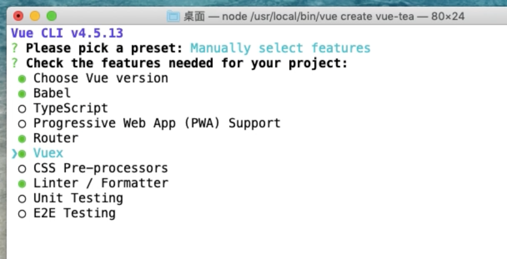
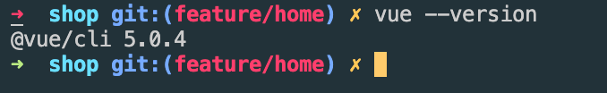
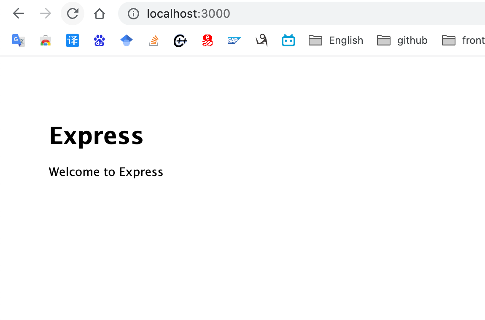

# vue + nodejs 实战

## 跟着视频做一个项目

[视频地址](https://www.bilibili.com/video/BV17b4y1778c?p=2&spm_id_from=pageDriver)

视频中使用的是 Vue-Cli v4.5:


做项目使用的 vue-cli 的版本:


## 项目创建

前端项目创建:

```shell
vue creat vue-tea
```

### 后端项目创建:

先全局安装 expres:

```shell
sudo npm install express-generator -g
```

局部安装项目名为 server 后端的项目:

```shell
express --view=ejs server
```

进入server文件夹,安装依赖:
```shell
cd server
npm install
```

检测后端项目是否创建成功:
```shell
npm start
```
localhost:3000



